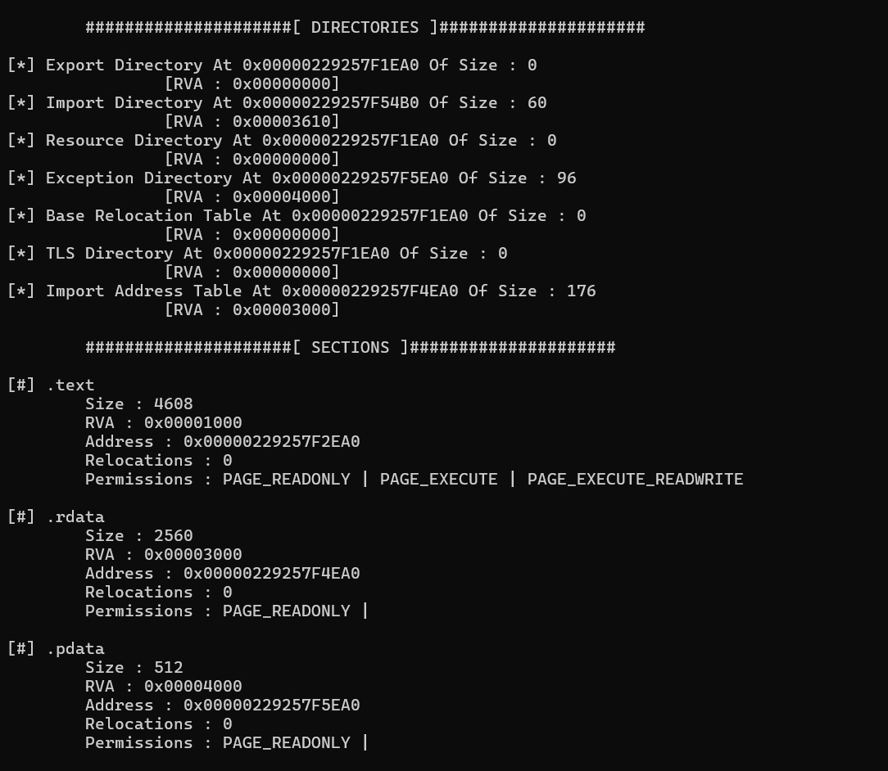

# Parse PE
It is a software that scans the PE header on the disk and returns some information such as Image DOS Headers, Image File Header, Image Optional Header, Directories, and sections.

Example of usage below:

